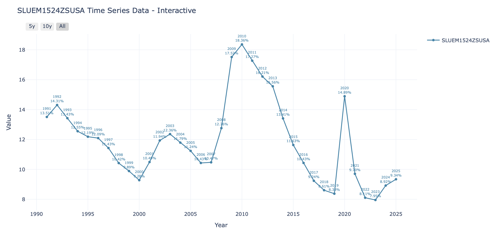
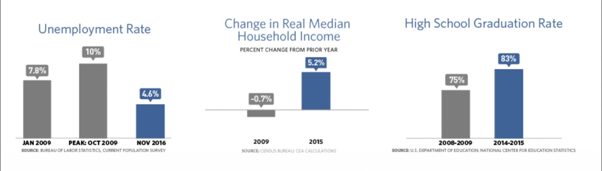

# 미국 청년 실업률 분석 (1991~2025)

> 🇺🇸 [English Version](README.md)

---

## 동기 (Motivation)

현재 AI로 인한 취업난이 한국을 비롯한 전 세계적으로 화두가 되고 있다. 캐나다에서 코업을 준비 중인 수학과 2학년으로서, 주변 친구들 대부분이 사전 경험 없이는 코업을 구하기 어렵다는 현실을 체감하고 있다. 실제로 수학과 학생의 첫 번째 코업 고용률은 **15%** 에 머물고 있다.

이러한 배경에서 1991년부터 2025년까지의 미국 청년 실업률 데이터를 두 가지 시각으로 들여다봤다.

1. **서술 분석**: 각 경제 위기가 청년 고용에 미친 영향, 위기별 회복 속도의 차이, 그리고 AI 시대로 이어지는 흐름을 파악한다.
2. **통계 모델링**: 금리, 물가, 산업생산 등의 매크로 변수들이 청년 실업률을 실제로 움직이는지, 아니면 청년 실업이 그냥 전체 고용 시장 흐름에 종속적으로 따라가는지 검증한다.

---

## 핵심 인사이트

- 청년 실업률은 **후행 지표** — 위기 발생 후 약 2년 뒤 정점 도달
- **구조적 위기** (2008)는 **외부 충격** (코로나)보다 회복이 훨씬 느림
- 청년층은 구조적으로 경기 회복 시 **마지막으로 흡수**되는 그룹
- AI 주도의 노동 대체가 이 구조적 불리함을 더욱 심화시킬 가능성 존재

---

## 데이터셋

| 변수 | 출처 | 설명 |
|---|---|---|
| `youth_unempl` | FRED (SLUEM1524ZSUSA) | 청년 실업률 (15~24세) |
| `fed_funds` | FRED (FEDFUNDS) | 연방기금 실효금리 |
| `cpi` | FRED (CPIAUCSL) | 소비자물가지수 (전년 대비 % 변화) |
| `unrate` | FRED (UNRATE) | 전체 실업률 |
| `indpro` | FRED (INDPRO) | 산업생산지수 (전월 대비 % 변화) |

**기간**: 1991-01 ~ 2025-12 (월별)

---

## 청년 실업률 추이



---

## 시기별 분석

### 1991~2000: 장기 호황과 실업률 하락

1991년 13%대였던 미국 청년 실업률은 2000년 9%대까지 약 9년간 지속적으로 하락했다. 이 시기 하락의 주요 원인으로는 세 가지를 꼽을 수 있다.

- **클린턴 정부의 재정 정책 (1993~)**: 재정 균형과 경제 성장 중심의 정책으로 고용 환경이 개선됐다.
- **냉전 종식 후 시장 확대**: 소련 붕괴와 유럽 사회주의 진영의 몰락으로 미국 기업들이 더 넓은 글로벌 시장을 확보했다.
- **IT 혁명**: 기술 호황으로 새로운 직종이 대거 생겨나며 청년 고용이 크게 늘었다.

그러나 2000년을 기점으로 IT 버블이 꺼지기 시작했고, **2001년 닷컴버블 붕괴**와 **9/11 테러**가 겹치며 실업률이 반등했다.

**참고자료**
- [FactCheck.org — 클린턴 임기 중 약 2,100만 개 일자리 창출](https://www.factcheck.org/2007/12/clinton-and-economic-growth-in-the-90s/)
- [BLS Monthly Labor Review — 1990년대 고용 성장 공식 분석](https://www.bls.gov/opub/mlr/2000/12/art1full.pdf)

---

### 2000~2010: 9/11, 금융위기, 그리고 역대 최고치

2001년 9/11 테러는 미국 경제에 큰 충격을 가했다. 실업률은 2001년 10.49%에서 2003년 12.36%까지 상승했다. 테러로 인한 주식시장 급락과 소비 심리 위축이 고용 시장에 직접적인 영향을 미쳤다.

이후 실업률은 2007년 10.47%까지 안정적으로 하락하며 경제가 회복세를 보였다. 그러나 **2008년 금융위기**가 찾아왔다. 2007년 주택 버블 붕괴로 시작된 서브프라임 모기지 사태가 연쇄적으로 금융 시스템 전체에 타격을 줬다.

주목할 점은 실업률이 **2008년 즉각 급등하지 않았다**는 것이다. 대부분의 기업들이 초기에는 버텼으나, 지속되는 경제 악화 속에 결국 대규모 해고를 단행했고, 약 2년 후인 **2010년 18.36%**로 1991~2025년 구간 중 최고치를 기록했다. 이는 실업률이 경제 위기에 즉각 반응하지 않는 **후행 지표**임을 보여주는 대표적인 사례다.

**참고자료**
- [Federal Reserve Bank of San Francisco — 9/11 이후 경제 영향 공식 보고서](https://www.frbsf.org/research-and-insights/publications/economic-letter/2001/12/the-us-economy-after-september-11/)
- [Federal Reserve History — 금융위기와 실업률 관계 공식 분석](https://www.federalreservehistory.org/essays/great-recession-and-its-aftermath)

---

### 2010~2017: 오바마 정부와 느린 회복

2010년 피크 이후 실업률은 2017년까지 약 **7년**에 걸쳐 서서히 하락했다. 오바마 정부는 의료 정책 개혁, 무역 정책 등 다양한 경기부양책을 시행하며 경제 회복을 이끌었고, 가계 소득 증가와 고등학교 졸업률 상승 등 사회 전반적인 지표도 개선됐다.



회복이 7년이나 걸린 이유는 금융위기 이후 기업들의 신규 채용 심리가 극도로 위축됐기 때문이다. 특히 **경력이 없는 청년층은 경기가 회복되더라도 가장 마지막에 고용 시장에 흡수되는** 구조적 특성이 회복을 더디게 만들었다.

**참고자료**
- [BLS — 금융위기 후 회복이 5년 이상 걸린 이유 분석](https://www.bls.gov/opub/mlr/2020/article/employment-recovery.htm)

---

### 2017~2025: 코로나 충격과 빠른 회복, 그리고 AI 시대

2017년 이후 실업률은 꾸준히 하락해 2019년 8.38%까지 내려왔다. 그러나 **코로나19**로 인해 2020년 실업률은 **14.89%** 까지 급등했다. 대면 서비스업이 직격탄을 맞았고, 소비와 경제 순환 자체가 멈추며 전방위적인 고용 충격이 발생했다.

그러나 회복 속도는 2008년과 극명하게 달랐다. **2021년 단 1년 만에 9.7%로** 5%p 이상 하락했다. 비대면 환경으로의 전환과 IT 대기업의 개발자 수요 급증이 주요 원인이다. 2008년 금융위기가 경제 구조 자체의 붕괴였다면, 코로나는 외부 충격에 의한 **일시적 정지**였기 때문에 회복 속도에서 결정적인 차이가 났다.

이후 **2023~2024년 빅테크 대규모 해고**로 실업률이 소폭 재상승했다. 2025년 현재 **9.34%** 를 기록한 청년 실업률은 AI의 급격한 발전으로 인한 인력 대체와 맞물려 당분간 상승 압력을 받을 것으로 우려된다.

> Anthropic 리포트는 AI로 인한 화이트칼라 직종 충격을 **"대공황급"** 으로 전망했으며, 일론 머스크는 10~20년 내 일이 선택사항이 될 것이라 예측한 바 있다.

이 데이터가 던지는 질문은 하나다 — **다음 회복 사이클에서 청년은 어떻게 포지셔닝해야 하는가.**

**참고자료**
- [Pew Research Center — 코로나 실업률 급등 후 2021년 빠른 회복 데이터](https://www.pewresearch.org/politics/2025/02/12/how-covid-19-changed-u-s-workplaces/)
- [BLS — 코로나 이후 IT 직종 성장 공식 전망](https://www.bls.gov/opub/btn/volume-11/mobile/what-the-long-term-impacts-of-the-covid-19-pandemic-could-mean-for-the-future-of-it-jobs.htm)
- [Fortune — Anthropic AI가 대체 가능한 직업들](https://fortune.com/2026/03/06/ai-job-losses-report-anthropic-research-great-recession-for-white-collar-workers/)
- [Fortune — 일론머스크, 10-20년 안에 일은 선택사항이 될 것](https://fortune.com/2026/01/19/when-does-elon-musk-say-work-will-be-optional-and-money-will-be-irrelevant-ai-robotics/)

---

## 프로젝트 구조

```
macro_youth_unempl/
├── fetch_data.py          # FRED API를 통한 데이터 수집
├── preprocess.py          # 데이터 정제 및 차분 처리
├── eda.ipynb              # 탐색적 데이터 분석
├── model.ipynb            # 시계열 모델링 (ADL)
├── data/
│   ├── raw/               # FRED 원본 데이터
│   ├── processed/         # 병합 및 차분 데이터셋
│   └── img/               # README에 사용된 차트
├── .env.example           # API 키 템플릿
└── requriement.txt        # Python 의존성
```

---

## 설치 및 실행

```bash
# 1. 레포 클론
git clone https://github.com/torigood/youth_unempl.git
cd youth_unempl

# 2. 의존성 설치
pip install -r requirements.txt

# 3. API 키 설정
cp .env.example .env
# .env 파일을 열고 FRED API 키 입력 (https://fred.stlouisfed.org/docs/api/api_key.html)

# 4. 데이터 수집
python fetch_data.py

# 5. 전처리
python preprocess.py
```

